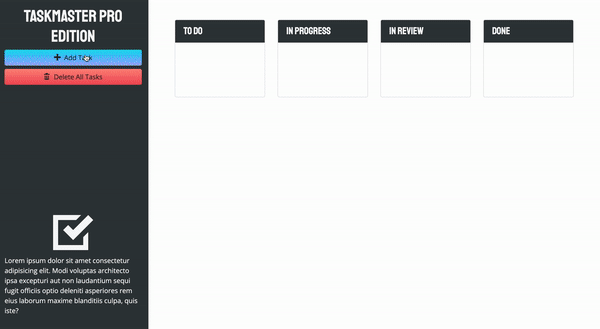

# Taskmaster Pro

## Descripton
This project is a task-management application using JavaScript and jQuery to manipulate the DOM. It also utilizes Bootstap as the CSS framework. Task data is persistent using localStorage.

## Usage
This application will allow users to create tasks with descriptions and due dates. Users also are able to drag and drop tasks based on their process and can delete any task.

## Mock Up
The following animation demonstrates the application functionality:

## Built With
* HTML
* CSS
* JavaScript
* jQuery

## Website
https://amir-hackett.github.io/taskmaster-pro/
